# Stats Pipeline Schematic

**Date**: 1-May-26  
**Status**: Canonical schematic for statistical field flow  
**Audience**: Engineers and agents debugging or reviewing writers/readers of `edge.p.*`, `model_vars[*]`, or `posterior.*`.

This page is the single canvas for the two statistical flows:

- **Model-vars generation**: offline Bayes compiler plus FE topo Step 1.
- **Projection / forecasting**: FE topo Step 2, BE conditioned forecast (CF), and analysis runners.

The parent docs remain authoritative for detail. This schematic answers the quick question: for a field, which subsystem wrote it, on which clock, where does it persist, and who reads it next?

## Canvas

Every box below lives in exactly one layer band. Cross-band movement is explicit: source-ledger fields move to promoted fields only through `applyPromotion`; scoped evidence moves to scoped current-answer fields only through FE topo Step 2 or CF.

```mermaid
flowchart LR
  classDef source fill:#eef2ff,stroke:#5b67b7,color:#111;
  classDef evidence fill:#ecfdf3,stroke:#3a8f5a,color:#111;
  classDef answer fill:#fff7e6,stroke:#b9770e,color:#111;
  classDef promoted fill:#f5eefc,stroke:#7e4aa8,color:#111;

  subgraph S["Band 1: source-ledger / aggregate"]
    Bayes["Bayes compiler + bayesPatchService + posteriorSliceContexting<br/>writes model_vars[bayesian].probability, latency, quality, fit_diagnostics<br/>trigger: offline fit / DSL re-project<br/>persistence: parameter file commit -> graph projection"]
    Param["Parameter file<br/>posterior.slices[], posterior.fit_history[], evidence<br/>trigger: offline result apply<br/>persistence: commit / git"]
    MVBayes["Live/request graph source<br/>model_vars[bayesian]<br/>aggregate posterior; not query-scoped"]
    Step1["FE topo Step 1<br/>writes model_vars[analytic].probability and latency<br/>trigger: per-fetch<br/>persistence: graph / IDB, re-derived on refresh"]
    Selector["Source selector pin<br/>model_source_preference, model_source_preference_overridden<br/>trigger: user authoring<br/>persistence: graph / IDB"]
  end

  subgraph E["Band 2: current-evidence / scoped"]
    Rows["Window / cohort observation rows<br/>I6/I7 data fetch<br/>trigger: per-fetch<br/>persistence: source cache / response"]
    Evidence["p.evidence.{n, k, mean}<br/>query-scoped observed evidence<br/>writers: FE evidence aggregation; CF evidence_k/n via I12<br/>persistence: graph / IDB"]
    DBSnapshot["DB snapshot rows<br/>I11 BE-internal query<br/>trigger: per-CF / per-analysis<br/>persistence: snapshot DB"]
    Registry["73n primitive substrate (Stages 1-8 landed, default OFF)<br/>ConditionedTransitionPrimitive + compose_subject_span<br/>flag-gated readouts at row-builder seam<br/>trigger: per request when any DAGNET_*_READOUT flag is SHADOW or ON<br/>persistence: request only; result_cache.py for primitive / composed posteriors"]
  end

  subgraph A["Band 3: current-answer / scoped"]
    Step2["FE topo Step 2<br/>reads active source + p.evidence.* + effective DSL<br/>writes provisional p.mean, p.stdev, p.stdev_pred, p.latency.completeness, p.latency.completeness_stdev<br/>trigger: per-fetch<br/>persistence: graph / IDB"]
    CF["BE CF / handle_conditioned_forecast<br/>I10/I12; reads request graph + DB snapshot + engorged evidence<br/>writes authoritative p.mean, p.stdev, p.stdev_pred, p.latency.completeness, p.latency.completeness_stdev, p.evidence.{k,n}<br/>trigger: per-fetch CF race or direct CF consumer<br/>persistence: graph / IDB when applied"]
    Today["live conditioning locus (default)<br/>compute_forecast_trajectory / compute_forecast_summary<br/>PreparedConditioningEvidence is compatibility metadata only post-73n Stage 8<br/>persistence: request only"]
    Locks["Manual output locks<br/>mean_overridden, stdev_overridden<br/>pin current-answer fields only; no model_vars[manual]<br/>trigger: user overtype<br/>persistence: graph / IDB"]
    GraphReaders["Graph-consumer runners<br/>path, path_to_end, path_through, branch_comparison, end_comparison<br/>read edge.p.* via apply_visibility_mode"]
    DirectCF["Direct CF consumers<br/>conversion_funnel calls handle_conditioned_forecast<br/>consumes CF response before rendering"]
    InBand["In-band forecast consumers<br/>cohort_maturity -> compute_forecast_trajectory<br/>surprise_gauge -> compute_forecast_summary"]
  end

  subgraph P["Band 4: promoted / model field"]
    Promotion["applyPromotion<br/>single writer from active model_vars source + selector<br/>trigger: per-promotion"]
    Promoted["p.posterior.*; p.latency.posterior.*;<br/>p.forecast.{mean, stdev, source};<br/>p.latency.{mu, sigma, t95, path_t95, path_mu, path_sigma, promoted_t95, promoted_onset_delta_days, ...}<br/>persistence: graph / IDB"]
    Resolver["model_resolver / carrier consumers<br/>forecast_state, forecast_runtime, graph_builder, path_runner<br/>read active model_vars and promoted fields; never read L5 as a prior"]
  end

  Bayes -->|"I1 submit; I2 result; I3 file upsert"| Param
  Param -->|"I4 in-schema projection"| MVBayes
  Param -->|"I5 request engorgement"| CF
  Rows --> Evidence
  Rows --> Step1
  MVBayes --> Promotion
  Step1 --> Promotion
  Selector --> Promotion
  Promotion --> Promoted
  Promoted --> Step2
  Evidence --> Step2
  Step2 --> GraphReaders
  Promoted --> Resolver
  MVBayes --> Resolver
  Evidence --> CF
  DBSnapshot --> CF
  Promoted --> CF
  CF --> Evidence
  CF --> GraphReaders
  CF --> DirectCF
  Today --> InBand
  Today -->|"primitive readouts (default OFF; SHADOW/ON behind DAGNET_*_READOUT flags)"| Registry
  CF --> Today
  Locks -->|"skip lock-respecting writers"| Step2
  Locks -->|"skip lock-respecting writers"| CF

  class Bayes,Param,MVBayes,Step1,Selector source;
  class Rows,Evidence,DBSnapshot,Registry evidence;
  class Step2,CF,Today,Locks,GraphReaders,DirectCF,InBand answer;
  class Promotion,Promoted,Resolver promoted;
```

## Writer Ledger

| Output surface | Writer | Trigger | Persistence | Downstream readers |
|---|---|---|---|---|
| `edge.p.model_vars[source='bayesian']` | Bayes compiler result applied by `bayesPatchService`; `posteriorSliceContexting` re-projects the matching slice on DSL change | Offline fit / DSL re-project | Source is commit-backed parameter file; graph projection survives in graph / IDB | `applyPromotion`; `model_resolver.resolve_model_params`; model cards |
| `edge.p.model_vars[source='analytic']` | FE topo Step 1 | Per-fetch | Graph / IDB only; never parameter-file backed | `applyPromotion`; FE topo Step 2; BE resolver as aggregate prior |
| `edge.p.posterior.*` | `applyPromotion` | Per-promotion | Graph / IDB | Model cards; diagnostic display; compatibility readers |
| `edge.p.latency.posterior.*` | `applyPromotion` | Per-promotion | Graph / IDB | Forecast engine latency resolution; model cards |
| `edge.p.forecast.{mean, stdev, source}` | `applyPromotion` | Per-promotion | Graph / IDB | Display mode `f`; FE topo Step 2; graph-consumer runners after visibility projection |
| `edge.p.latency.{mu, sigma, t95, path_t95, path_mu, path_sigma, ...}` | `applyPromotion` from the active source, with user-field fallbacks for the editable latency fields | Per-promotion | Graph / IDB | FE topo Step 2; BE forecast runtime; lag/latency displays |
| `edge.p.evidence.{n, k, mean}` | FE evidence aggregation from scoped observation rows; CF can also apply `evidence_k` / `evidence_n` through I12 | Per-fetch / per-CF | Graph / IDB | FE topo Step 2; display mode `e`; BE CF diagnostics |
| `edge.p.mean` | FE topo Step 2 provisionally; BE CF authoritatively when it lands | Per-fetch / per-CF | Graph / IDB | Display mode `f+e`; graph-consumer analysis runners; beads |
| `edge.p.stdev` | FE topo Step 2 provisionally; BE CF maps `p_sd_epistemic` to `p.stdev` | Per-fetch / per-CF | Graph / IDB | Bands and graph consumers that need epistemic current-answer spread |
| `edge.p.stdev_pred` | BE CF maps predictive response `p_sd` to `p.stdev_pred`; FE may populate provisionally when available | Per-fetch / per-CF | Graph / IDB | Predictive current-answer bands |
| `edge.p.latency.completeness` | FE topo Step 2 provisionally; BE CF authoritatively when it lands | Per-fetch / per-CF | Graph / IDB | Current-answer blend, funnel variance mixture, cohort maturity displays |
| `edge.p.latency.completeness_stdev` | FE topo Step 2 provisionally where available; BE CF authoritatively when it lands | Per-fetch / per-CF | Graph / IDB | Uncertainty bands and funnel variance mixture |
| `model_source_preference`, `model_source_preference_overridden` | User selector pin | User authoring | Graph / IDB | `applyPromotion`; `model_resolver` |
| `mean_overridden`, `stdev_overridden` | User overtype of current-answer outputs | User authoring | Graph / IDB | Lock-respecting writers; UpdateManager |

Notes:

- The live graph field is `p.stdev`, not `p.sd`. CF response fields use `p_sd` / `p_sd_epistemic`; the I12 apply mapping translates them to `p.stdev_pred` / `p.stdev`.
- `model_vars[manual]` is retired in the live post-73b contract. Manual authoring bypasses both generation pipelines through selector pins and per-field output locks.
- `model_vars[analytic].probability.{alpha, beta}` flows only from the analytic source-layer mirror contract. It is not synthesised from scoped `p.evidence.{n, k}`.

## Reader Tail

Analysis dispatch has three forecast-state read shapes:

| Reader category | Examples | Reads / calls | Persistence |
|---|---|---|---|
| Graph-consumer runners | `path`, `path_to_end`, `path_through`, `branch_comparison`, `end_comparison` | Read `edge.p.mean`, `edge.p.evidence.mean`, or `edge.p.forecast.mean` through `apply_visibility_mode` | Render-only |
| Direct CF consumers | `conversion_funnel` | Calls `handle_conditioned_forecast`; consumes per-edge `p_mean`, `p_sd`, `p_sd_epistemic`, `completeness`, `conditioned` | Funnel response is render-only; embedded CF apply can persist I12 fields |
| In-band forecast consumers | `cohort_maturity`, `surprise_gauge` | Invoke `compute_forecast_trajectory` or `compute_forecast_summary` for the requested subject | Render-only |

Analysis runners do not trigger the fetch-pipeline Stage 2 CF race. They either read the graph state already produced by Stage 2, call the public CF surface directly, or run an in-band forecast kernel for their own render-only result.

## Interface Labels

This schematic reuses the `FORECAST_STACK_DATA_FLOW.md` interface labels and introduces no `I18`.

- `I1`-`I5`: Bayes submit, result delivery, parameter-file upsert, in-schema graph projection, request-graph engorgement.
- `I6`-`I8`: FE data fetch, typed observation rows, write to `model_vars[analytic]`.
- `I9`-`I12`: request-graph copy, FE-to-BE analyse/CF request, BE snapshot query, CF response/apply mapping.
- `I13`-`I17`: prepared analysis dispatch, runner-analyze surface, cohort-maturity dispatch, snapshot-analyse dispatch, funnel runner's embedded CF call.

## Conditioning Locus

**Live default (flag-OFF)**: evidence conditioning happens inside the forecast engine request path. `forecast_runtime.build_prepared_runtime_bundle` assembles `PreparedForecastRuntimeBundle.p_conditioning_evidence` (post-73n Stage 8 this object is **compatibility metadata only** — not an evidence-ownership decider); `compute_forecast_trajectory` / `compute_forecast_summary` consume it and apply the importance-sampling update while solving the requested span. This remains the live path for every CF request unless a primitive-readout flag is enabled.

**73n primitive substrate (Stages 1-8 landed 1-May-26, default OFF)**: a typed `ConditionedTransitionPrimitive` substrate sits inside the CF kernel boundary. Subset / effective-evidence policy and the conjugate update apply **once at primitive construction** (`primitive_conditioning.py`); the primitives are then composed by `compose_subject_span` (and 73m's `compose_carrier_to_x` for active cohort `A != X`) into per-readout outputs. Four flag-gated readouts at the shared row-builder seam: `DAGNET_SINGLE_HOP_PRIMITIVE_READOUT`, `DAGNET_MULTI_HOP_SUBJECT_COMPOSITION`, `DAGNET_MULTI_HOP_WINDOW_READOUT`, `DAGNET_ACTIVE_COHORT_CARRIER_READOUT`. Each accepts `OFF` (live path), `SHADOW` (compute substrate readout in parallel and emit divergence diagnostics, return live result), or `ON` (return substrate readout). Production flag-ON for any of the four is currently blocked on the maturity-aware likelihood migration follow-up; SHADOW is the highest mode recommended in production.

**See**: [FORECAST_STACK_DATA_FLOW.md](FORECAST_STACK_DATA_FLOW.md) §B.6 for the full post-73n CF substrate; [STATS_SUBSYSTEMS.md](STATS_SUBSYSTEMS.md) §3.3a for the narrative; [BE_RUNNER_CLUSTER.md](BE_RUNNER_CLUSTER.md) §3a for the file map.

## Parent Docs

Use this page for the cross-pipeline schematic, then jump to the parent doc for detail:

- [TOPOLOGY.md](TOPOLOGY.md): where statistical compute sits in the app-wide architecture.
- [STATS_SUBSYSTEMS.md](STATS_SUBSYSTEMS.md): subsystem narratives, field-authority notes, and entry-point disambiguation.
- [FORECAST_STACK_DATA_FLOW.md](FORECAST_STACK_DATA_FLOW.md): labelled interface contracts `I1`-`I17`.
- [FE_BE_STATS_PARALLELISM.md](FE_BE_STATS_PARALLELISM.md): Stage 2 orchestration, FE topo / CF race mechanics, and `--no-be`.
- [BE_RUNNER_CLUSTER.md](BE_RUNNER_CLUSTER.md): backend runner and forecast-engine file map.
